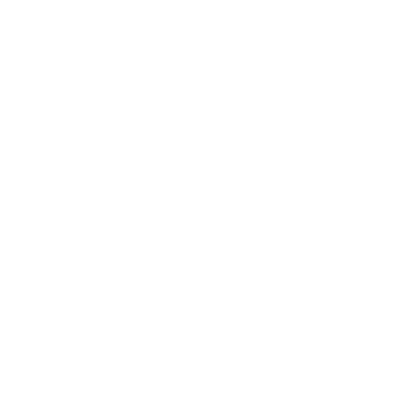

    

---

# TrackTician

 

TrackTician is an innovative web application designed to empower Formula One strategists with real-time, data-driven insights, enabling them to make precise and effective decisions in the heat of a race. 

## Key Features:

- **Comprehensive Race Analytics:** Gain access to in-depth race analytics to analyze performance metrics and trends.

- **Intuitive Visualization Tools:** Visualize complex data sets with intuitive and interactive visualization tools for enhanced decision-making.

- **User-Friendly Interface:** Seamlessly navigate through TrackTician's user-friendly interface designed for ease of use and accessibility.

## Benefits:

- **Optimized Race Strategies:** Leverage TrackTician's insights to optimize race strategies and gain a competitive edge.

- **Anticipate Competitor Moves:** Stay ahead of the competition by anticipating competitor moves and adjusting strategies in real-time.

- **Achieve Victory on the Track:** With TrackTician, teams can make informed decisions that increase the likelihood of achieving victory on the track.

By harnessing the power of cutting-edge technology, TrackTician equips teams with the essential tools they need to maximize performance and achieve success in Formula One racing.

*This project was made in accordance with the [Inversity](https://inversity.co/) challenge running from 09/02/24 - 10/03/24*

---