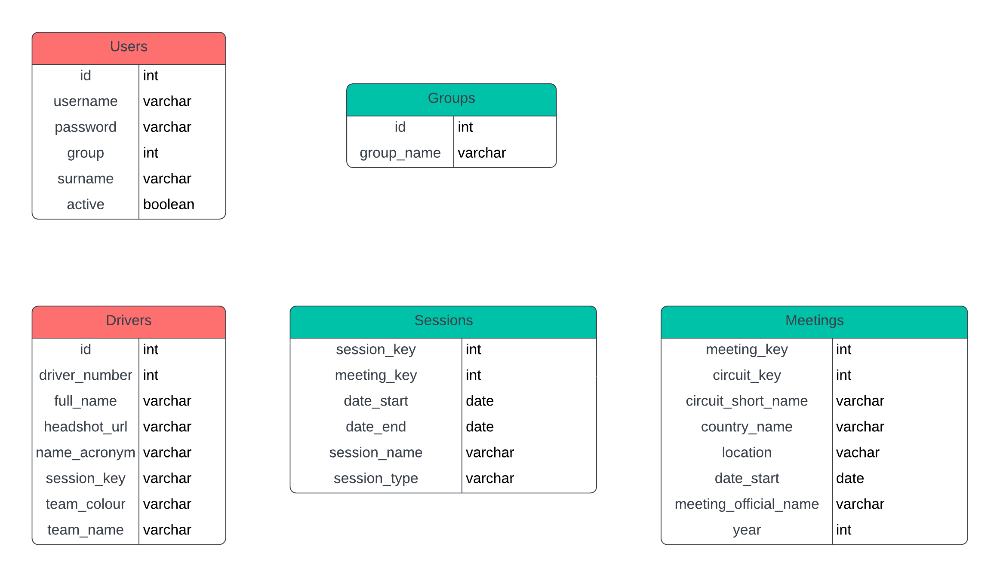

    

---

# TrackTician

 

TrackTician is an innovative web application designed to empower Formula One strategists with real-time, data-driven insights, enabling them to make precise and effective decisions in the heat of a race. 

## Key Features:

- **Comprehensive Race Analytics:** Gain access to in-depth race analytics to analyze performance metrics and trends.

- **Intuitive Visualization Tools:** Visualize complex data sets with intuitive and interactive visualization tools for enhanced decision-making.

- **User-Friendly Interface:** Seamlessly navigate through TrackTician's user-friendly interface designed for ease of use and accessibility.

## Benefits:

- **Optimized Race Strategies:** Leverage TrackTician's insights to optimize race strategies and gain a competitive edge.

- **Anticipate Competitor Moves:** Stay ahead of the competition by anticipating competitor moves and adjusting strategies in real-time.

- **Achieve Victory on the Track:** With TrackTician, teams can make informed decisions that increase the likelihood of achieving victory on the track.

By harnessing the power of cutting-edge technology, TrackTician equips teams with the essential tools they need to maximize performance and achieve success in Formula One racing.

*This project was made in accordance with the [Inversity](https://inversity.co/) challenge running from 09/02/24 - 10/03/24*

---

## Table of Contents

1. [**Market Research**](#market-research)
    - [**Inversity ChatBot**](#inversity-chatbot)
    - [**Further Research**](#further-research)
        - [**Blogs**](#blogs)
        - [**Podcasts**](#podcasts)
        - [**YouTube**](#youtube)
        - [**Miscellaneous**](#miscellaneous)
2. [**UX**](#ux)
    - [**User Stories**](#user-stories)
    - [**Design**](#design)
        - [**Color Scheme**](#color-scheme)
        - [**Typography**](#typography)
    - [**Wireframes**](#wireframes)
    - [**Database Design**](#database-design)
---

## Market Research

In this section, I will highlight and explains areas of research conducted prior to starting the development process.

By researching suitable areas first, I will be able to identify pertinent points in which to focus on, and understand completely what it is I am trying to achieve with this project.

### Inversity ChatBot

The [Inversity](https://inversity.co/) Chat Bot, dedicated to this challenge, offered invaluable assistance. With initial project specifications being vague, the Chat Bot provided essential insights into the requirements, setting a solid starting point.

Below I will highlight some of the most effective prompts and responses from the Chat Bot.

**"What forms of data do you look at when making decisions?"**

Reponse
 
"We look at a variety of data, including timing data that shows us the sector and lap times of all cars, GPS data for tracking car positions and performance, and simple telemetry data like throttle and brake usage. We also review onboard videos and listen to driver radio communications. All this information helps us understand the car's performance, the condition of the tyres, and what our competitors are doing, which is crucial for making quick and informed race strategy decisions."

 

**"What decisions does this data lead to?"**

Reponse
 
"The data leads to decisions like when to pit for new tyres, which tyre compound to choose, and how to manage the race pace. We also decide whether to be aggressive or conservative with our strategy, when to react to competitors' moves, and how to handle unexpected events like safety cars or changes in weather. The goal is to optimize our race performance and outsmart the competition, aiming for the best possible finish for our drivers."

 

**"Can you summarise the types of data that affect each decision in a bullet point style?"**

Reponse
 
"Sure, I can summarize it in a more conversational way using bullet points:

- Timing data helps us decide on pit stop timing and to understand our relative race pace.
- GPS data is useful for fine-tuning car setup and driving lines, as well as anticipating competitors' moves.
- Telemetry data informs us on tyre wear and whether adjustments to driving style are needed to preserve the car.
- Onboard videos can be reviewed for driver technique and identifying areas of the track where we can gain or lose time.
- Driver radio communications give us insight into the driver's comfort with the car and any immediate issues that need addressing.

Each type of data contributes to the overall strategy and the decisions we make throughout the race."

 

**"Can you summarise the types of data that affect each decision in a bullet point style?"**

Reponse
 
"We're always looking to improve our decision-making process. A few things that could help include:

- Enhanced data analysis tools that can quickly sift through large volumes of data and highlight the most critical information.
- AI-driven predictions that can anticipate race developments, like tyre performance under different conditions.
- Improved visualization of data to make complex information more understandable at a glance.
- Software that can summarize and prioritize radio communications from competitors, giving us strategic insights without the cognitive overload.

These advancements would help us make even faster and more accurate decisions during the high-pressure environment of a race."

 

**"What challenges do you currently face when making decisions during races?"**

Reponse
 
"One of the biggest challenges is the sheer volume of data we receive; it can be overwhelming. We need to identify key information quickly to make informed decisions. Another challenge is dealing with conflicting data from different sources, which can create uncertainty. Additionally, we have to be very agile, responding to changing race conditions and competitor strategies in real-time, which requires both speed and accuracy in our decision-making process."

 

**"Are there any other challenges you haven't mentioned?"**

Reponse
 
"Yes, there are a few more challenges:

- Interpreting the reliability and accuracy of the data, especially when the quality can vary, like with GPS signals on certain tracks.
- Managing communication effectively among the team, ensuring that crucial information is shared without distraction.
- Adapting to unexpected events, such as accidents or safety cars, which can turn the race on its head and require a rapid reassessment of strategy.
- Balancing risk versus reward when considering different strategic options, which can have a significant impact on the race outcome.

These challenges require a combination of experience, intuition, and robust software tools to navigate successfully."

 

**"How effective would a geospatial visualisation be for the team?"**

Reponse
 
"A geospatial visualization could be very effective for our team. It would allow us to see the real-time positions of our cars in relation to others on the track, understand spatial relationships and gaps, and make more informed decisions about overtaking, defending, and pit stop timing. If it's intuitive and quick to interpret, it could be a valuable addition to our strategy toolkit."

### Further Research

In this section, I will highlight areas of further research conducted, picking out the pertinent points that will affect the project development.

#### Blogs

Blogs appeared as a great place to start. They provide more information as to what teams focus on when making decisions as well as the currently available technology for decision making.

I will highlight certain sections of blogs along with the information taken forward.

- [Catapult "F1 STRATEGY: HOW FORMULA 1 TEAMS OPTIMIZE ANALYSIS"](https://www.catapult.com/blog/formula-1-race-strategy-analysis)
    - During a race weekend, teams closely monitor **tyre wear**, **temperature**, and **performance** to make informed decisions about *when to change tyres* and *which type of tyres to use*.
    - By considering factors like **track temperature**, **tyre wear rates**, and **lap times**, they can make informed decisions about when to pit and which tyres to use.

The information extracted from the above blog assisted in understanding what factors assist with decision making when deciding when to change tyres, and what type of tyre to use. This will be taken forward to prvide a form of predictive analysis for tyre management.

- [Secrets of the Pit Wall | The Art of Race Strategy in F1](https://www.linkedin.com/pulse/secrets-pit-wall-art-race-strategy-f1-anish-garg/)
    - F1 teams have access to extensive **weather forecasting tools**, which are constantly monitored during the race. If rain clouds loom on the horizon, the strategists must decide *when and if to switch to wet tires*.
    - An undercut is where a driver pits before the car(s) in front to try and gain a position. This occurs when a team believes fresh rubber will yield more pace and create a net gain on the track by the time the other car(s) have pitted.
    - The overcut is essentially the opposite of the undercut, in that it involves letting the leading car pit first, and then taking advantage of the clean air in front of you to build up a gap so that when you do eventually pit, you still come out of the pits ahead of the driver that was originally in front.

The above information will help understand the principles behind undercuts and overcuts, alongside important weather considerations.

#### Podcasts

#### YouTube

#### Miscellaneous

---

## UX

### User Stories

- As a Formula One team strategist, I want to access real-time telemetry data during a race, so that I can make informed decisions about race strategy.

- As a Formula One team engineer, I want to visualize live data streams of speed, throttle, brake, and other performance metrics, so that I can monitor the car's performance and make adjustments as needed.

- As a Formula One team manager, I want to receive alerts and notifications about critical events during the race, such as tire wear, engine temperature, or potential safety issues, so that I can take immediate action if necessary.

- As a Formula One team analyst, I want to analyze historical race data and performance metrics, so that I can identify patterns and trends that can inform future race strategies.

- As a Formula One team member, I want to collaborate with other team members in real-time, sharing insights and coordinating strategy adjustments during the race.

- As a Formula One team member, I want TrackTician to integrate seamlessly with our existing race management tools and systems, so that we can access all necessary information in one centralized platform.

- As a Formula One team strategist, I want TrackTician to provide customizable dashboards and reports, so that I can focus on the most relevant data and insights for our team's specific needs.

- As a Formula One team member, I want TrackTician to be accessible from any device, including laptops, tablets, and smartphones, so that I can stay connected and informed wherever I am during the race.

### Design

This web application will be designed to have a professional theme in a dashboard stlye that allows users to interact with the information and decide what is on their screens.

#### Color Scheme

The following colour scheme will be used throughout the site, and will aim to provide a professional approach.

| 1 | 2 | 3 | 4 | 5 | 6 |
| :---: | :---: | :---: | :---: | :---: | :---: |
|  |  |  |  |  |  |
| #000000 | #282A3A | #735F32 | #C69749 | #171717 | #FFFFFF |

These will be placed as *:root* variables within the style.css file in order to be used across all necessary elements.

#### Typography

The main font that will be applied to the web application is [Montserrat](https://fonts.google.com/specimen/Montserrat), with a fallback font of **Sans-Serif**.

### Wireframes

- 
    - [Balsamiq](https://balsamiq.com/) - Balsamiq was used in order to create the below wireframes during the design process.

[**Desktop Wireframe**](./design/desktop-wireframe.png)

    

[**Mobile Wireframe**](./design/mobile-wireframe.png)

The mobile version will follow the same principles as the desktop design, however the nav bar will expand once the icon is clicked so that it does not take up too much of the screen.

    

### Database Design

Below is the schema design for the database that will hold and handle data about:
- Site Users
- Races (Meetings)
- Sessions
- Drivers

This is a relational database handled by [PostgreSQL](https://www.postgresql.org/) which uses primary and foreign keys from each table in order to relate entries to eachother.

    

